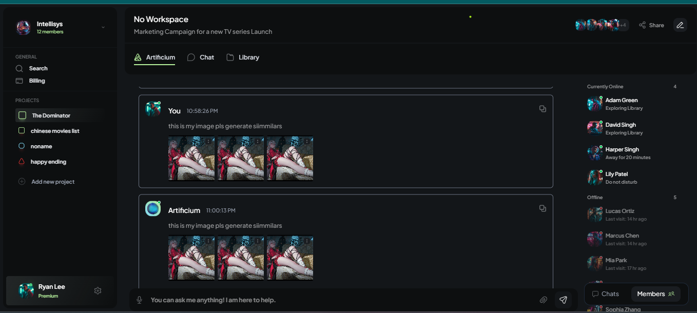

    Artificium Clone

    

    A modern, responsive collaborative workspace application built with the MERN stack.

    Welcome to the Artificium Clone repository! This project is a clone of a collaborative workspace platform, featuring user authentication, workspace management, and a sleek dark-themed UI powered by Tailwind CSS. Deployed on Netlify (frontend) and Render (backend), it integrates AWS S3 for storage, Firebase for authentication, and MongoDB for data management.

    [Live Frontend Demo](http://artificium-clone.netlify.app)
    [Backend URL](https://artificium-clone.onrender.com)
    [GitHub Repository](https://github.com/ASHiSHxNagar/Artificium)
    Table of Contents
    About the Project
    Features
    Tech Stack
    Installation
    Usage
    Deployment
    Contributing
    License
    Future Enhancements
    Contact
    Acknowledgments
    Live Demo
    Check out the live application here:

    http://artificium-clone.netlify.app

    Explore the frontend to experience the login, registration, and workspace features in action!

    Backend URL
    The backend is hosted on Render. You can activate it if inactive by sending a request to:

    [(https://artificium-clone.onrender.com)]

    (Note: The free tier on Render may spin down after 15 minutes of inactivity. A simple GET request to the root URL or any endpoint will wake it up. Check the Render dashboard logs for status.)

    About the Project
    This project is a personal endeavor to replicate the core functionalities of a collaborative workspace tool like Artificium. Built over weeks with dedication, it showcases a responsive design, secure authentication, and seamless integration of modern web technologies. The goal was to create a functional prototype that can be extended for real-world use.

    Features
    User Authentication: Register, login, and Google OAuth integration using Firebase.
    Workspace Management: Create or join workspaces with dynamic URL generation.
    Responsive Design: Fully responsive UI with Tailwind CSS, optimized for desktops and mobiles.
    Dark Theme: Sleek, modern dark-themed interface with gradient accents.
    API Integration: RESTful backend with MongoDB data storage and AWS S3 for potential file uploads.
    Tech Stack
    Frontend: React, Tailwind CSS (v4)
    Backend: Node.js, Express.js
    Database: MongoDB (via MongoDB Atlas)
    Authentication: Google Firebase
    Storage: AWS S3
    Hosting: Netlify (Frontend), Render (Backend)
    Installation
    To run this project locally, follow these steps:

    Copy
    git clone https://github.com/ASHiSHxNagar/Artificium.git
    cd artificium-clone
    Backend Setup
    Navigate to the backend folder:

    cd backend
    Install dependencies:

    npm install
    Create a .env file in the backend folder and add the following:
    text

    PORT=3000

    MONGO_URI=your_MONGO_URI
    JWT_SECRET = your_JWT_SECRET
    AWS_ACCESS_KEY_ID=''
    AWS_SECRET_ACCESS_KEY=''

    TYPE=""
    PROJECT_ID: ""
    PRIVATE_KEY_ID: ""
    PRIVATE_KEY: ""
    CLIENT_EMAIL: ""
    CLIENT_ID: ""
    AUTH_URI: ""
    TOKEN_URI: ""
    AUTH_PROVIDER_X509_CERT_URL: ""
    CLIENT_X509_CERT_URL: ""
    UNIVERSE_DOMAIN: ""

    #This supresesses the aws JS v2 warning

    # AWS_SDK_JS_SUPPRESS_MAINTENANCE_NODE_MESSAGE='1'

    (Get Firebase credentials from Firebase Console > Create New Project > Project Settings > Service Accounts.)
    Start the backend:
    bash

    npm start
    Frontend Setup
    Navigate to the fe folder:

    cd ../frontend
    Install dependencies:

    npm install
    Create a .env file in the frontend  folder and add:

    # chnage its url value with your backend url

    VITE_SERVER_DOMAIN= http://localhost:3000

    # get this from firebase project

    VITE_FIREBASE_API_KEY=""
    VITE_FIREBASE_AUTH_DOMAIN=""
    VITE_FIREBASE_PROJECT_ID=""
    VITE_FIREBASE_STORAGE_BUCKET=""
    VITE_FIREBASE_MESSAGING_SENDER_ID= ""
    VITE_FIREBASE_APP_ID=""
    VITE_FIREBASE_MEASUREMENT_ID="G-"

    Start the frontend:
    npm start

    Run the App
    Ensure both backend and frontend are running. Open http://localhost:3000 in your browser.
    Usage
    Register a new account or log in with Google.
    Create a workspace or join an existing one by entering a unique name.
    Explore the responsive design across different devices.
    Deployment
    This project is deployed for free using:

    Frontend: Netlify (http://artificium-clone.netlify.app)
    Connect your GitHub repository, set build command to npm run build, and publish directory to build.
    Add REACT_APP_API_URL as an environment variable with your Render backend URL.
    Backend: Render (https://artificium-clone.onrender.com)
    Set the root directory to backend in Render’s dashboard.
    Add environment variables (MONGODB_URI, JWT_SECRET, FIREBASE_CREDENTIALS) in Render’s environment settings.
    Deploy and monitor logs for any issues.
    Note: Render’s free tier spins down after inactivity. Use a cron job (e.g., cron-job.org) to ping the backend URL every 10 minutes to keep it alive.

    Contributing
    Contributions are welcome! To contribute:

    Fork the repository.
    Create a new branch (git checkout -b feature-branch).
    Make your changes and commit (git commit -m "Add feature").
    Push to the branch (git push origin feature-branch).
    Open a Pull Request.
    License
    This project is licensed under the MIT License. See the LICENSE file for details.

    Future Enhancements
    This project is a living prototype with exciting potential for growth. Future enhancements might include:
    a
    Stunning UI Improvements: Adding cool hover animations, stylish effects, and advanced transitions using Tailwind CSS and libraries like Framer Motion to make the interface more engaging.
    Loading Optimization: Implementing lazy loading for images, code splitting, and caching strategies to enhance performance and reduce initial load times.
    Unit Testing: Integrating a testing framework like Jest or Vitest to ensure code reliability and facilitate maintenance.
    Custom Chatbot: Developing a tailored chatbot to assist users within the workspace, enhancing interactivity.
    Existing Chatbot APIs: Leveraging APIs like Dialogflow or ChatGPT to add conversational features for support or task assistance.
    Increased Security and Performance: Implementing rate limiting, input validation, and HTTPS enforcement, alongside optimizing database queries and API responses.
    Real-Time Chat Connection: Adding WebSocket or Socket.IO for real-time messaging between workspace members.
    Collaborative Tools: Introducing real-time document editing or task management features using libraries like Yjs or Firebase Realtime Database.
    Multi-Language Support: Adding i18n (internationalization) to make the app accessible to a global audience.
    Analytics Dashboard: Integrating tools like Google Analytics or a custom dashboard to track user engagement and workspace usage.
    Contributions to these features are highly encouraged!

    Contact
    Creator: [(https://github.com/ASHiSHxNagar)]
    Email: [ashishnagar043@gmail.com]
    GitHub: [https://github.com/ASHiSHxNagar/Artificium]
    Feel free to reach out with questions or feedback!

    Acknowledgments
    Inspired by the Artificium platform.
    Thanks to the open-source community for tools like React, Tailwind CSS, and Firebase.
    Big thanks to Grok 3 by xAI for helping out with some dev and deployment tips along the way!🫡
